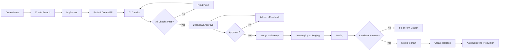

# Branch Protection Rules - 07nghiep

## Overview

This document describes the branch protection rules for the 07nghiep repository. These rules ensure code quality and prevent unauthorized changes to critical branches.

## Protected Branches

| Branch | Protection Level | Description |
|--------|-----------------|-------------|
| `main` | **Strict** | Production branch - requires most scrutiny |
| `develop` | **Standard** | Integration branch for features |
| `release/*` | **Strict** | Release preparation branches |

## Rule Configuration

### main Branch Protection

```
Settings > Branches > Add rule: main

☑ Require pull request reviews before merging
  └─ Required number of approvals: 2
  ☑ Dismiss stale reviews when new commits are pushed
  ☑ Require approval from code owners
  
☑ Require status checks to pass before merging
  └─ Required checks:
     ├─ typecheck (pass)
     └─ build (pass)
     
☑ Require branches to be up to date before merging

☑ Do not allow bypassing the above settings

☑ Include administrators
```

### develop Branch Protection

```
Settings > Branches > Add rule: develop

☑ Require pull request reviews before merging
  └─ Required number of approvals: 1
  ☑ Dismiss stale reviews when new commits are pushed
  
☑ Require status checks to pass before merging
  └─ Required checks:
     └─ CI (pass)
     
☑ Require branches to be up to date before merging

☑ Include administrators

☐ Do NOT check "Do not allow bypassing"
   (Allow admins to push directly for hotfixes)
```

## Branch Naming Convention

| Type | Pattern | Example |
|------|---------|---------|
| Feature | `feature/issue-{id}-{short-desc}` | `feature/issue-1-database-schema` |
| Bug Fix | `fix/issue-{id}-{short-desc}` | `fix/issue-42-login-redirect` |
| Chore | `chore/issue-{id}-{short-desc}` | `chore/issue-99-update-deps` |
| Hotfix | `hotfix/{desc}` | `hotfix/critical-auth-bypass` |
| Release | `release/v{major}.{minor}.{patch}` | `release/v1.0.0` |

## Workflow Summary



## CI Requirements

### For `main` Branch (Production)
All checks must pass:
- `pnpm check-types` (TypeScript)
- `pnpm build` (Build)
- `pnpm lint` (Linting)

### For `develop` Branch (Integration)
Required checks:
- `pnpm check-types` (TypeScript)
- `pnpm build` (Build)

### For Feature Branches
Optional but recommended:
- TypeScript check
- Build check

## GitHub Settings Steps

### Step 1: Navigate to Branch Protection
1. Go to repository **Settings**
2. Click **Branches** in left sidebar
3. Click **Add rule**

### Step 2: Configure for `main`
```
Branch name pattern: main

Require pull request reviews before merging
  Required number of approvals: 2
  ☑ Dismiss stale reviews
  ☑ RequireCODEOWNERS approval

Require status checks to pass before merging
  Search for status checks:
  - typecheck
  - build
☑ Require branches to be up to date before merging

☑ Include administrators

☑ Do not allow bypassing the above settings
```

### Step 3: Configure for `develop`
```
Branch name pattern: develop

Require pull request reviews before merging
  Required number of approvals: 1
  ☑ Dismiss stale reviews

Require status checks to pass before merging
  Search for status checks:
  - CI

☑ Include administrators
```

## CODEOWNERS Setup

Create `.github/CODEOWNERS` file:

```shell
# Default owners for everything
* @team-lead

# Core packages
/packages/db/** @dev1
/packages/auth/** @dev1
/packages/api/** @dev1

# Candidate App
/apps/candidate/** @dev2

# Employer App
/apps/employer/** @dev3

# Admin App
/apps/admin/** @dev4

# Shared UI
/packages/ui/** @dev2 @dev3 @dev4

# GitHub configs
.github/** @dev1 @dev4

# Server
/apps/server/** @dev1 @dev4
```

## Force Push & Branch Deletion

| Branch | Force Push | Delete | Notes |
|--------|------------|--------|-------|
| `main` | ❌ Blocked | ❌ Blocked | Never force push |
| `develop` | ❌ Blocked | ❌ Blocked | Keep history clean |
| `release/*` | ❌ Blocked | ⏳ After merge | Clean up after release |
| `feature/*` | ⚠️ Allowed | ✅ After merge | Clean up old branches |
| `hotfix/*` | ⚠️ Allowed | ✅ After merge | Clean up after merge |

## Emergency/Hotfix Procedure

For critical production bugs:

1. **Create hotfix branch from main:**
   ```bash
   git checkout main
   git pull
   git checkout -b hotfix/critical-bug-fix
   ```

2. **Implement fix with tests**

3. **Create PR directly to main:**
   - Title: `[HOTFIX] Brief description`
   - Labels: `hotfix`, `priority/critical`
   - Skip CI delay if urgent

4. **Get expedited review:**
   - Tag team lead for immediate review
   - Minimum 1 approval for hotfix

5. **Merge and deploy**

6. **Sync to develop:**
   ```bash
   git checkout develop
   git merge main
   git push
   ```

## Admin Override

Only for emergency cases:
1. Go to repository **Settings > Branches**
2. Click **Bypass branch protection** (requires admin rights)
3. Document reason in PR

---

**Last Updated:** 2026-04-13
